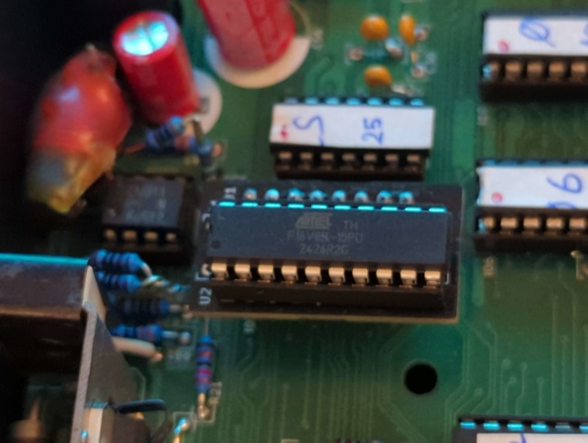

# Replacement of I03 (color PROM) for the Thomson MO5

> [WARNING] Please read carefully this note before using this project. It contains important facts.

Content

1. What is **Replacement of I03 (color PROM) for the Thomson MO5**, and when to use it ?
2. What should you know before using **Replacement of I03 (color PROM) for the Thomson MO5** ?
3. How to use **Replacement of I03 (color PROM) for the Thomson MO5** ?
4. Known issues
5. Miscellanous

## 1. What is **Replacement of I03 (color PROM) for the Thomson MO5**, and when to use it ?

**Replacement of I03 (color PROM) for the Thomson MO5** replaces the PROM that is used to convert pixel colors represented as a 4 bits value (pastel, red, green, blue) and a supplemental bit for blanking signal, into a RGB-222 value and a supplemental trigger signal for the builtin analog video incrustation feature (requires a specific extension) of the Thomson MO5.

### Licence

**Replacement of I03 (color PROM) for the Thomson MO5** is published under the Creative Commons CC0 license. You can find a copy of the licence there : https://creativecommons.org/publicdomain/zero/1.0/legalcode

You can copy, modify, distribute and perform the work, even for commercial purposes, all without asking permission.

**Replacement of I03 (color PROM) for the Thomson MO5** is distributed in the hope that it will be useful, but WITHOUT ANY WARRANTY; without even the implied warranty of MERCHANTABILITY or FITNESS FOR A PARTICULAR PURPOSE.

### Release notes

#### Release v2.0.0

* Resolves #6 : Add a breakout connector with R[1..2], V[1..2] and B[1..2] for adding custom DAC mods

Contains schematics in PDF files, gerber archive, and the JED file.

#### Release v1.0.0

Contains schematics in PDF files, gerber archive, and the JED file.

#### Release v1.0.0-rc1

**Hardware only** 

Contains schematics in PDF files, and gerber archive.

## 2. What should you know before using **Replacement of I03 (color PROM) for the Thomson MO5** ?

**Replacement of I03 (color PROM) for the Thomson MO5** is made of an hardware part to hold a GAL16v8 (or its current available compatible component ATF16v8) hereafter called "GAL", and a fusemap to be flashed onto said GAL.

* The hardware part is a Kicad 8 project describing the adapter from original chip socket in the computer motherboard
* The fusemap part is a source to be compiled by relevant tool to obtain a suitable JED fusemap.

> Do not use **Replacement of I03 (color PROM) for the Thomson MO5** if this project is not suitable for your project.

## 3. How to use **Replacement of I03 (color PROM) for the Thomson MO5** ?

### From sources

To get the latest available work, one must clone the git repository.

	git clone --recurse-submodules https://github.com/sporniket/kicad-conversions--thomson-mo5--i03-replacement.git

Then, open the project with Kicad 8.

To produce the fusemap... TO BE WRITTEN

## 4. Known issues
See the [project issues](https://github.com/sporniket/kicad-conversions--thomson-mo5--i03-replacement/issues) page.

## 5. Miscellanous

### Report issues
Use the [project issues](https://github.com/sporniket/kicad-conversions--thomson-mo5--i03-replacement/issues) page.
