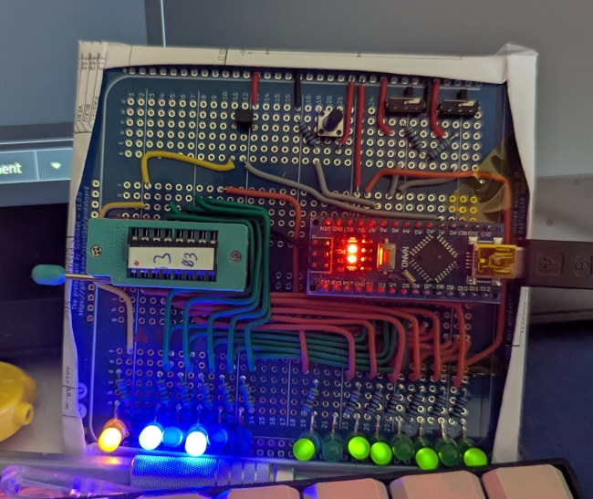

# Testbench

The testbench allows to get data from an existing PROM, as well as checking data emitted by the replacement. Based on **Arduino Nano**, it consists of a hardware project, and a firmware project.

Design goals :

* a ZIF socket to swap devices under test
* The power supply of the device under test can be switched off ; the Arduino nano receives the switch command and enable/disable the power accordingly. It allows to swap devices without unplugging the testbench.
* Another switch for an "Automatic/Manual" mode.
* A push button to trigger an action that depends on the mode.
* Some LEDs to display :
  * whether the power supply of the device under test is on or off.
  * the address probed by the Arduino.
  * the data output of the device.
* The Arduino Nano send to the serial link the data read from the device under test, and display an OK/KO status with the onboard LED.

## Hardware project

**The schematic** is enough to build a device using prototype boards, or even breadboard, as I did. I have used a normal PNP transistor (rated with 500mA) from my parts box. Your mileage may vary.

**A pcb** is provided for convenience, it is not tested, but should be operationnal.

One particular parts for this PCB, selected because I have a lot of spares : the switches are [G-Switch SS-22F12-G060](https://www.lcsc.com/product-detail/Slide-Switches_G-Switch-SS-22F12-G060_C2848906.html)

The ZIF socket may be directly soldered, or plugged in a standard narrow DIP-16 socket, for easier servicing or recycling of this part.

## Firmware project

For now the implemented feature are :

* The power supply of the device under test can be switched on/off using the corresponding switch
* The address are probed continuously and the data is output to the serial. Open the serial monitor of the Arduino IDE to get the report.

That was enough to complete the main project.
